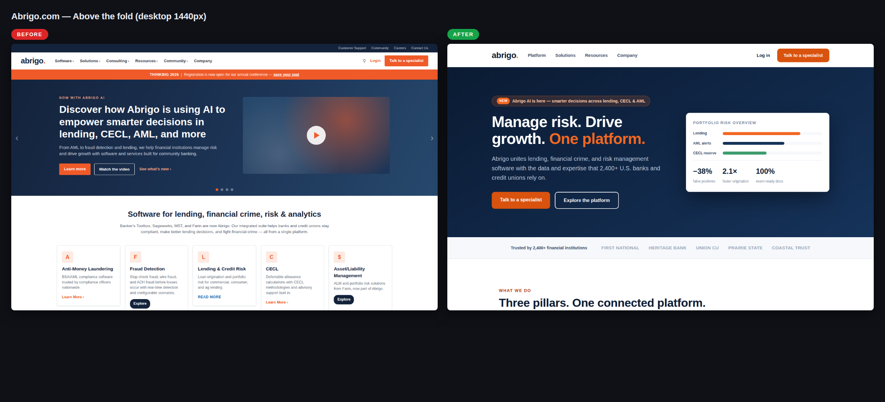
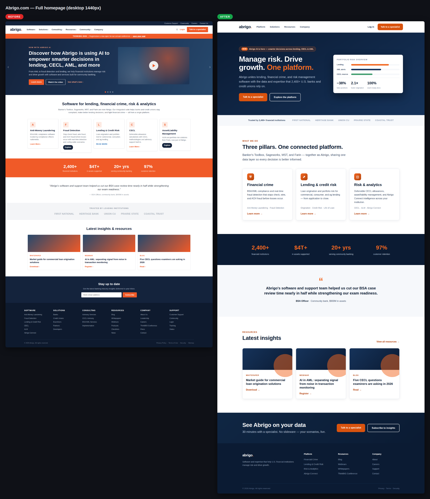
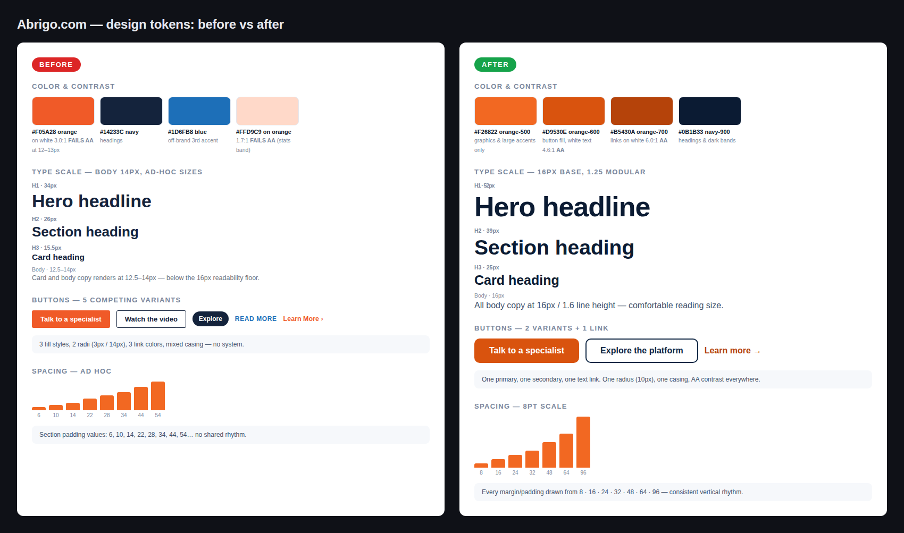

# Design audit — abrigo.com (June 10, 2026)

**Scope:** Homepage, desktop + mobile.
**Method:** `/design-audit` workflow (`.claude/skills/design-audit/`).

> ⚠️ **Note on the "before" visuals:** abrigo.com blocks automated access from this
> environment (HTTP 403 for both direct and proxied fetches), so live screenshots could
> not be captured. The "before" images are a high-fidelity recreation built from
> research into the current site (hero messaging, nav structure, product pillars,
> orange/navy brand, section order). Layout patterns and findings are representative;
> exact pixels, imagery, and copy may differ from production. Re-run
> `tools/design-audit/capture.sh https://www.abrigo.com ...` from a network that can
> reach the site to swap in real captures.

## The visuals

| # | Comparison | File |
|---|---|---|
| 1 | Above the fold, desktop |  |
| 2 | Full homepage, desktop |  |
| 3 | Mobile 390px |  |
| 4 | Design tokens (color, type, buttons, spacing) |  |

Live mockups: [`before/index.html`](before/index.html) · [`after/index.html`](after/index.html)

## Findings & what the redesign does

### 1. Announcement-led carousel hero — **High**
The hero is a rotating carousel whose lead slide promotes a feature announcement
("Discover how Abrigo is using AI to empower smarter decisions…") with three competing
CTAs, plus a conference promo strip above it. Carousels split attention and the first
5 seconds don't tell a new visitor what Abrigo does for them.
**After:** static hero, outcome-led headline ("Manage risk. Drive growth. One
platform."), the AI announcement demoted to a pill above the headline, exactly one
primary CTA ("Talk to a specialist") + one secondary.

### 2. Brand orange fails contrast at text sizes — **High**
The brand orange (~#F05A28) is used for 12–13px links and button labels on white
(≈3.0:1, below the 4.5:1 WCAG AA minimum), and the stats band sets pale-orange 12px
text on solid orange (≈1.7:1).
**After:** a three-step orange ramp — #F26822 reserved for graphics/large accents,
#D9530E for button fills (white text = 4.6:1 AA), #B5430A for links on white (6.0:1).
Stats band moved to navy with orange numerals.

### 3. Five competing button styles — **Medium**
Filled orange (3px radius), navy outline, navy pill (14px radius), uppercase blue text
link, and orange text link all appear on one page — including an off-brand blue.
**After:** one primary, one secondary, one text-link pattern; single 10px radius;
the blue accent removed.

### 4. Body text below readability floor — **Medium**
Body and card copy renders at 12.5–14px with tight line height; headings jump between
ad-hoc sizes (34/26/15.5px).
**After:** 16px base with a 1.25 modular scale (52/39/25/16), 1.6 line height,
line lengths capped at ~34–54em.

### 5. Trust signals buried below the fold — **Medium**
Customer count, retention rate, logos, and the testimonial sit 3–4 screens down; the
first thing after the hero is more marketing copy.
**After:** "Trusted by 2,400+ financial institutions" logo strip directly under the
hero; stats band promoted; one strong testimonial kept.

### 6. Crowded navigation + utility bar — **Medium**
Six top-level dropdowns plus a four-link utility bar, search, login, and CTA compete in
the header; the conference promo adds a third horizontal band before content.
**After:** four top-level items (Platform, Solutions, Resources, Company), login, one
CTA; utility links moved to the footer.

### 7. Five uneven product cards, no grouping — **Low**
AML, Fraud, Lending, CECL, and ALM are presented as five flex cards with uneven heights
and three different CTA treatments, with no conceptual grouping.
**After:** three pillars (Financial crime · Lending & credit risk · Risk & analytics)
in a uniform grid, products listed as sub-labels, one CTA pattern.

### 8. Ad-hoc spacing, heavy footer — **Low**
Section padding values (6/10/14/22/28/34/44/54px…) share no rhythm; the footer carries
six columns of ~30 links.
**After:** strict 8pt spacing scale; footer slimmed to brand + three columns.

## Re-running this audit

```bash
# capture live site (needs network access to the target)
bash tools/design-audit/capture.sh https://www.abrigo.com audits/<dir>/before before

# or trigger the GitHub Action: Actions → "Design Audit" → Run workflow → url

# compose comparisons
bash tools/design-audit/compose.sh before.png after.png "Title" out.png
```
Or just run `/design-audit <url>` in Claude Code.
